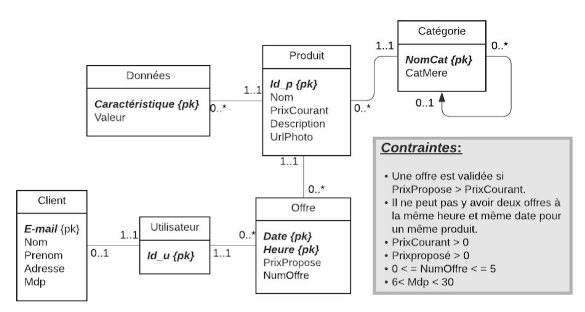

	   ████████                                    
	  ██░░░░░░██                     █████         
	 ██      ░░   ██████   ███████  ██░░░██  █████ 
	░██          ░░░░░░██ ░░██░░░██░██  ░██ ██░░░██
	░██    █████  ███████  ░██  ░██░░██████░███████
	░░██  ░░░░██ ██░░░░██  ░██  ░██ ░░░░░██░██░░░░ 
	 ░░████████ ░░████████ ███  ░██  █████ ░░██████
	  ░░░░░░░░   ░░░░░░░░ ░░░   ░░  ░░░░░   ░░░░░░ 
# Projet Bases de Données

Welcome to the Shoe Store Management System repository! This repository serves as a mirror for a project completed in December 2021 by four students for a Database Management course. The original repository is hosted on the internal GitLab of Ensimag. The project is a console-based application for managing a shoe store, with a focus on ensuring compliance with GDPR regulations in the database design. The application is written in Java and uses an SQL database to store and manage shoe-related information.



# Rapport
## Modélisation du problème

Ce que nous avons tiré de l'analyse du problème:
- Un produit possède un identifiant unique, un intitulé, un prix courant, une description, un lien vers une photo et un ensemble de couple caractéristiques/valeurs ainsi qu'un identifiant de la catégorie à laquelle il appartient.
- Une catégorie est identifiée par son nom et peut posséder des sous catégories. Initialement nous pensions donc mettre un attribut sous_catégorie mais finalement on a choisi de mettre un attribut de catégorie mère pour parcourir notre arbre des catégories en partant des feuilles.
- Un client est identifié par un email unique, un mot de passe, un nom, un prénom, une adresse.
- Un utilisateur est identifié par une clé unique.
- Une offre est identifiée par l’identifiant d’un produit, une date et une heure, elle contient également le prix proposé et l’identifiant de l’utilisateur concerné. Puis nous avons décidé de rajouter le numéro d’offre pour savoir combien d'enchères ont déjà été effectuées sur un produit.

Après réflexion, nous nous sommes rendu compte que pour normaliser les relations nous devions créer une table spécialement pour stocker les couples (caractéristique, valeur): 
On aurait donc une donnée identifiée par une caractéristique et contenant la valeur de cette caractéristique.
### Dépendances Fonctionnelles: 
- Id_p, Date, Heure -> PrixPropose, Id_u, Id_p, NumOffre
- Id_p -> Intitulé, PrixCourant, Description, URL_photo, NomCategorie
- Email -> Nom,  Prenom, Adresse, Mdp. 
- Email -> Id_u
### Contraintes:
- RGPD:  droit à l'oubli (on supprime un utilisateur mais sauvegarde ses offres.)
- Une offre est validée si PrixPropose > PrixCourant (si offre refusée,  pas enregistrée.)
### Contraintes de Valeur: 
- PrixCourant > 0
- PrixPropose> 0	
- date et heure au bon format 
- NumOffre € [1,5]		
- mdp > 6
### Contraintes de Multiplicité:
- id_u -/-> Email
- Id_p -/-> Caracteristique
- NomCat -/->  CatMere
### Schéma Entités/Associations

### Traduction en relationnel

Pour traduire notre Schéma E/A en relationnel, nous avons utilisé l’automatisation étudiée en classe:
- Nous avons d’abord  examiné les entités faibles: Données/Produit et Offre/6 <= Mdp <= 30 Produit.
- Puis celles de cardinalité (1..1): Client avec Utilsateur, Catégorie. 

Ce qui nous donne: (les clefs primaires apparaissent en gras, soulignées.
Les identifiants sont en int.)

- Produit(id_p, NomCat, Intitulé, PrixCourant, Descrption, UrlPhoto) -> 3FNBCK
(PrixCourant en float le reste en string.)
- Utilisateur(id_u) -> 3FNBCK

- Client(Email, id_u, Nom, Prenom, Adresse, Mdp) 
(Pas 3FNBCK car id_u -> email, nom, prenom, adresse, mdp)
(Tout en string.)
- Categorie(NomCat, CatMere) -> 3FNBCK
- Offre(id_p, Date, Heure, id_u, PrixPropose) -> 3FNBCK
(Date et Heure au format java.sql.Date et java.sql.)(Time, PrixPropose en float.)
- Donnees (Caracteristique, id_p, Valeur) -> 3FNBCK
(Tout en string.)
Contraintes:
- PrixCourant > 0
- PrixProposé > 0
- 0 < = NumOffre < = 5
- 6 <= Mdp <= 30

Afin de respecter la contrainte de droit à l'oubli, nous avons dû faire des choix qui ont conduit à ce que notre table Client ne soit pas 3FNBCK mais seulement 2FN.
## Les fonctionnalités
### Parcours du catalogue
1. Après avoir récupéré l’email d’un client (que l’on appellera input.email ) et le mot de passe rentré, nous devons récupérer le mot de passe associé à l’email afin de vérifier que les deux correspondent.
2. Si le client souhaite parcourir les catégories et sous-catégories il suffit de récupérer les produits de chaque catégorie et de les afficher par ordre décroissant de nombre d’offres et par ordre alphabétique. Si le client souhaite parcourir les catégories recommandées, nous devons compter les offres faites par le client et n’ayant pas abouti dans chaque catégorie. Et, nous devons aussi compter le nombre total d'offres effectuées par l’ensemble des clients et  par catégories ainsi que le nombre de produits par catégorie afin d’effectuer une moyenne et afficher les catégories par ordre décroissant de nombre moyen d’offres par produit.
3. Nous devons récupérer les informations d’un produit contenu dans la table Produit mais aussi dans la table Données ( s’il y  en a).
### Enchères
1. Nous devons récupérer les produits disponibles à la vente (i.e donc le nombre d’offres est inférieur à 5) et récupérer le prix courant de celui-ci (qui correspond à la dernière offre effectuée dessus) afin de vérifier si le prix proposé est supérieur au prix courant.
2. Nous devons récupérer le numéro de la dernière offre effectuée afin d’enregistrer la nouvelle offre validée avec pour numéro d’offre l’ancien numéro + 1. Ensuite, nous devons aussi mettre à jour le nouveau prix courant du produit.
### Droit à l’oubli
Nous devons supprimer le compte client associée à l’adresse email entrée et mettre à jour l’identifiant client.
## Requêtes SQL
### Parcours du catalogue
1. Vérification du mot de passe:
``` sql
SELECT Mdp FROM Client WHERE Client.Email=input.Email
```
2. Affiche les produits de la catégorie input.cat par ordre alphabétique:
``` sql
SELECT id_p FROM Produit ORDER BY Produit.Intitule WHERE NomCat=input.Cat;
```
3. Compte le nombre d'offres de l'utilisateur input.id_u dans la catégorie input.cat:
``` sql 
COUNT(id_p) FROM Offre JOIN Produit ON Produit.id_p=Offre.id_p WHERE Offre.NumOffre < 5 AND Produit.NomCat=input.Cat AND Offre.id_u=input.id_u;
```
4. Compte le nombre d'offres totales dans la catégorie input.cat:
``` sql 
COUNT(id_p) FROM Offre JOIN Produit ON Produit.id_p=Offre.id_p WHERE OffreNumOffre < 5 AND Produit.NomCat=input.Cat;                                     
```
5. Compte le nombre de produits pour la catégorie input.Cat:
``` sql
COUNT(id_p) FROM Categorie WHERE Categorie.NomCat=input.Cat;
```
6. Affiche toutes les caractéristiques du produit input.id_p:
``` sql
SELECT Produit.Intitule, Produit.PrixCourant, Produit.Description, Produit.UrlPhoto, Donnees.Caracteristique, Donnees.Valeur FROM Produit JOIN Donnees ON Donnees.id_p=input.id_p WHERE Produit.id_p=input.id_p ;
```
### Enchères
1. Affiche la liste des produits que id_u peut acheter dans la table catégorie  
``` sql 
SELECT * FROM PRODUIT WHERE ID_P IN ( SELECT id_p FROM Offre HAVING COUNT(num_offre) < 5 GROUP BY id_p);
```
2. Affiche le prix courant du produit input.id_p:
``` sql
SELECT PrixCourant FROM Produit WHERE Produit.id_p=input.id_p;
```
3. Affiche le numéro d’offre de la dernière offre faite sur le produit input.id_p:
``` sql
SELECT MAX(NumOffre) FROM Offre WHERE Produit.id_p=input.id_p;
```
4. Si offre validée par étape 1, la valide en l’enregistrant: (achat si NumOffre = 5): 
``` sql
INSERT INTO Offre VALUES (‘input.id_p’,  ‘input.date’, ‘input.heure’, ‘input.id_u’,  ‘input.prixpropose’, ‘input.numderniereoffreplusun’)
```
5. Met à jour le nouveau prix (input.PrixPropose) du produit input.id_p:
``` sql
UPDATE Produit SET PrixCourant = ‘input.PrixPropose’ WHERE  Produit.id_p=input.id_p ;
```
### Droit à l’oubli
1. Affiche l’id_u du client (input.email) à supprimer:
``` sql
SELECT id_u FROM Client WHERE Client.Email = input.Email;
```
2. Supprime le client input.id_u à supprimer:
```sql 
DELETE FROM Client WHERE id_u =  id_u_a_supprimer;
```
3. On insère un nouveau id_u qui sera utilisé:
``` sql
INSERT INTO Utilisateur VALUES(new_id_u);
```
4. On associe les offres du old_id_u à ce nouveau id_u:
``` sql
UPDATE Offre SET id_u = new_id_u WHERE id_u =  id_u_a_supprimer;
```
5. Finalement on supprime old_id_u de la table, on n’aura plus aucune trace de lui:
``` sql
DELETE FROM Utilisateur WHERE id_u =  id_u_a_supprimer;
```
## Bilan du projet
Nous avons étudié le problème afin de concevoir la base de données tous ensemble ce qui a été très instructif chacun comprenant des nuances du sujet différentes. Puis nous nous sommes répartis les tâches plus techniques individuellement ou en binôme tout en présentant toujours nos résultats aux autres membres de l’équipe. Le point le plus difficile pour nous a été de comprendre les formes normales cela nous a conduit à recommencer notre analyse entièrement une première fois puis faire d’autres modifications par la suite comme l’ajout de la relation Données. Notre produit final a donc beaucoup évolué depuis notre première idée qui n’était pas assez normalisée. Nous avons d’ailleurs remarqué très tard que la relation Client n’était pas 3FNBCK et sommes donc conscients que nous aurions peut-être pu chercher une façon de normaliser plus cette relation. Cependant, notre relation nous paraissait être la plus adaptée afin de répondre aux différentes contraintes et notamment celle du droit à l’oubli, nous avons donc fait le choix de laisser cette relation 2FN.

